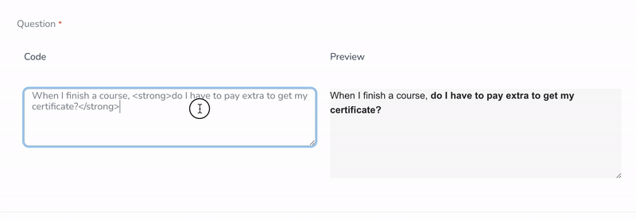

# Nova HTML Code Field

[](https://packagist.org/packages/interaction-design-foundation/nova-html-code-field)
[](https://packagist.org/packages/interaction-design-foundation/nova-html-code-field)

A Laravel Nova field that provides a powerful HTML code editor with real-time preview capabilities.
Write raw HTML and see instant results, with the preview rendered in an isolated iframe to prevent style conflicts with Nova's UI.



## Features

- Real-time HTML preview
- Isolated preview environment using iframes
- Custom CSS injection support
- Customizable preview template
- Compatible with Laravel Nova 4.x and 5.x

## Installation

You can install the package via composer:

```bash
composer require interaction-design-foundation/nova-html-code-field
```

The package will automatically register its service provider.

## Usage

### Basic Usage

```php
use InteractionDesignFoundation\NovaHtmlCodeField\HtmlCode;

public function fields(NovaRequest $request): array
{
    return [
        HtmlCode::make('HTML Content', 'content'),
    ];
}
```

### Advanced Usage

```php
use InteractionDesignFoundation\NovaHtmlCodeField\HtmlCode;

public function fields(NovaRequest $request): array
{
    return [
        HtmlCode::make('HTML Content', 'content')
            // Include stylesheets into iframe for more accurate preview
            ->styles([
                'https://cdn.example.com/custom.css', // from a CDN
                Vite::asset('resources/css/app.css'), // from your app
            ])
            // Wrap the HTML content in a template ("%CODE%" is required)
            ->previewTemplate('<section class="panel">%CODE%</section>'),
    ];
}
```

## Contributing

Please see [CONTRIBUTING](CONTRIBUTING.md) for details on how to contribute to this project.

### Testing

```bash
composer test
```

### Code Style

```bash
# Fix code style
composer cs:fix
```

## Security

If you discover any security-related issues, please email the maintainers instead of using the issue tracker.

## Credits

- [Interaction Design Foundation](https://github.com/InteractionDesignFoundation)
- [All Contributors](../../contributors)

## License

The MIT License (MIT). Please see [License File](LICENSE) for more information.
